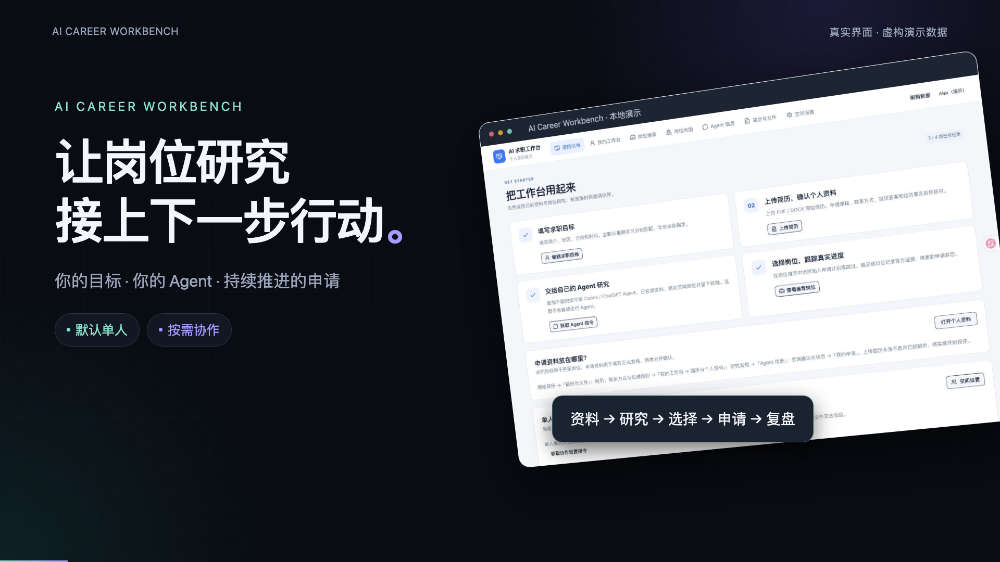
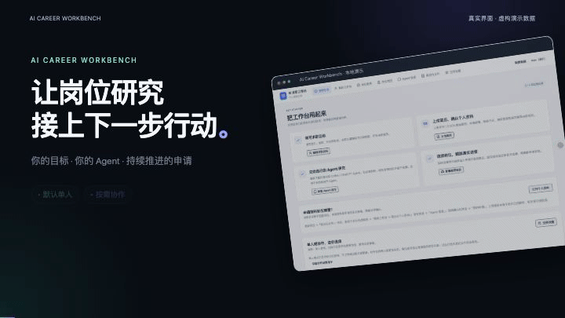

# AI Career Workbench

**Turn your Agent's job research into a clear next step.**

A local-first workspace for your career goals, résumés, job recommendations, application progress and evidence. Start solo. Add partner collaboration when you need it.

[中文](README.md) · **English**

  [](LICENSE)

[Quick start](#quick-start-mac) · [Give this to your Agent](docs/AGENT-START.en.md) · [Collaboration](#optional-partner-collaboration) · [Report a bug](https://github.com/Cornelius-Chen/AI-Career-Workbench/issues/new/choose)

## See it in 40 seconds

[](https://github.com/Cornelius-Chen/AI-Career-Workbench/releases/download/v0.1.0/career-demo.mp4)

[Watch / download the MP4](https://github.com/Cornelius-Chen/AI-Career-Workbench/releases/download/v0.1.0/career-demo.mp4) · [Editable React / Remotion source](docs/video/README.md)

The demo uses the actual interface with separate **fictional profiles, companies and jobs**. It does not show real vacancies or successful applications. The video has Chinese captions; the current application UI is also Chinese.



## What you can do

| Feature | How it helps |
| --- | --- |
| Career goals and documents | Give your Agent your target role, region, skills, timing and real résumé |
| Evidence-backed Agent notes | Keep findings, sources and next actions available for the next research session |
| Job recommendations | Review matching reasons and decide whether to add a job to your own plan or skip it |
| Application tracking | Filter by stage, role type and region; keep preparation and submission evidence together |
| Job map | Switch between recommended and confirmed submitted jobs; inspect role types and locations |
| Optional collaboration | Share useful leads, progress and Agent findings while keeping each member's goals separate |

**Your Agent performs the research; the app organizes the records.** Saving a request or uploading a résumé does not automatically run an Agent. Adding a plan is not proof of submission. A success page, application ID or confirmation email is needed to record a confirmed submission.

The personal application profiles and rules currently focus on U.S. job searches. The map covers the U.S.; remote or unlocated jobs remain in the list. Installation and launcher instructions currently focus on macOS.

## Quick start (Mac)

Install [Node.js 22.13+](https://nodejs.org/en/download) and Git. Use your own Codex / ChatGPT Agent with the file, browser or local command capabilities needed for the tasks you request.

Solo mode does not require a GitHub login, Cloudflare account or model API key.

```sh
git clone https://github.com/Cornelius-Chen/AI-Career-Workbench.git
cd AI-Career-Workbench
npm ci
npm run local:setup -- --name "Your name"
npm run local:start
```

Wait for setup to finish, then open http://127.0.0.1:4317/team on **that computer**. A fresh installation starts with a blank database. It does not contain the author's personal information, résumés or application history.

For Agent-assisted installation, copy [the English Agent handoff](docs/AGENT-START.en.md) into your own Agent conversation.

After installation, double-click `start-local.command` in the project folder to start the app. Closing that launcher's terminal window stops the app.

### First session

1. In **使用引导** (Getting started), edit your goals: skills, desired region, full-time / summer internship and target year.
2. In **简历与文件** (Résumés and files), upload your real PDF / DOCX. In **我的工作台 → 简历与个人资料**, confirm your application information and factual experience.
3. Copy the guidance prompt into your Agent. It should read your information, check official recruitment pages and write useful findings and recommendations.
4. In **岗位推荐** (Job recommendations), accept or skip opportunities. Track accepted plans in **我的工作台** (My workbench).

An Agent with local command access can first read:

```sh
npm run local:agent -- context
```

Then follow [the command formats](docs/LOCAL-WORKBENCH.md#agent-操作) to write profiles, notes, recommendations and tasks. An Agent without the app's WebMCP tools can use these local commands; if it lacks the needed capabilities, it should report that limitation rather than claim the app was updated.

## Optional partner collaboration

Each member runs a local workbench on their own computer. A **separate private GitHub data repository** carries manually uploaded and downloaded encrypted updates. It is not a hosted shared website or a real-time chat service.

1. The creator enables collaboration in **空间设置** (Space settings) and follows [the setup guide](docs/LOCAL-WORKBENCH.md#从单人开启协作) to create their own private data repository.
2. Invite each partner's actual GitHub account. Privately send the generated installation files and encryption key.
3. Partners accept the private repository invitation and follow [the invited-member instructions](docs/LOCAL-WORKBENCH.md#受邀成员安装) using their own identity.
4. Each member fills in their own target role and year. Full-time and summer-internship recommendations are kept distinct.
5. Use upload, pull or bidirectional sync. Each member controls whether all of their résumés are shared; sharing is off by default.

The public repository contains program code. `.local/` contains your database, attachments, keys, installation and sync state. Do not publish that folder or invitation files. Turning résumé sharing off stops future sharing; files already downloaded or stored in history cannot be recalled.

Invited members can maintain their own goals, plans, files, recommendation decisions and Agent notes. The full private fact database, application contact details, résumé generation and personal application rules belong to an independent solo installation or the collaboration owner's private database; they are not copied to invited members. For a complete separate private workbench, install solo in a new directory.

Data access and source-code write access are separate. Code collaborators must be invited separately, or work in a shared fork. Pull and rebuild to see code changes; data sync does not update the program.

## Update your installation

Stop the app and preserve `.local/`. Save any local code changes before pulling.

```sh
git pull
npm ci
npm run local:setup
npm run local:start
```

Setup reuses the existing identity, database and keys. Do not delete `.local/` or overwrite it with archived cloud data. The previous cloud websites are retired.

## Feedback and contributions

- [Report a bug or suggest a feature](https://github.com/Cornelius-Chen/AI-Career-Workbench/issues/new/choose)
- Email: [Cornelius.Chen.RR@gmail.com](mailto:Cornelius.Chen.RR@gmail.com)
- [Contribution guide](CONTRIBUTING.md)

Include your OS and Node.js version, steps, expected result and actual error. Redact private information from screenshots and logs. If the workbench helps you, a Star helps other job seekers find it.

## License

[MIT](LICENSE). Third-party dependencies and components retain their own licenses. The optional video project has separate dependencies and is not required to install or run the workbench.
