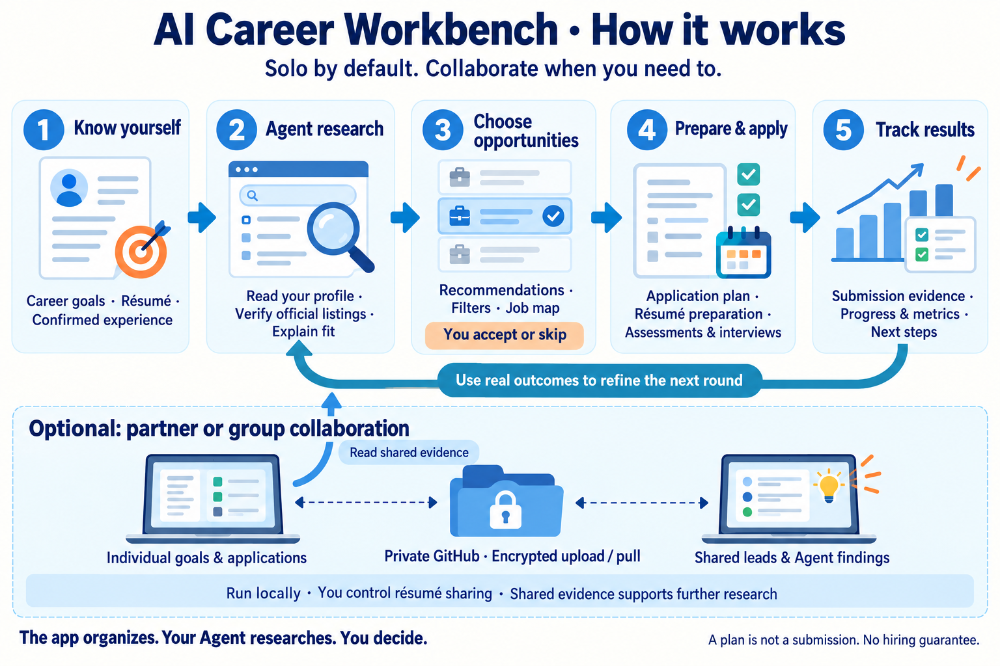

# AI Career Workbench

**Turn your Agent's job research into a clear next step.**

A local-first workspace for career goals, résumés, job recommendations, application progress and research evidence. Start solo. Add partner or group collaboration when you need it.

**English** · [简体中文](README.zh-CN.md)

  [](LICENSE)

[Install](#install-on-mac) · [Give this to your Agent](docs/AGENT-START.en.md) · [Where your information goes](#first-session-where-your-information-goes) · [Collaboration](#optional-partner-collaboration) · [Report a bug](#feedback-and-contact)

## Who is it for?

| Your need | How the workbench helps |
| --- | --- |
| Job-search information is scattered across files and chats | Keep goals, research evidence, progress and next steps together so your Agent can continue from prior work |
| Your application list is growing | Filter by stage, role type and region; find the materials and evidence for each application |
| You and a friend have different goals | Maintain separate goals and plans, share useful leads, and distinguish full-time roles from summer internships |
| You want personal information to stay on your computer | Store it locally; optionally sync encrypted collaboration updates through a separate private repository |

**You need:** a Mac, Node.js 22.13+, Git and your own Codex / ChatGPT Agent. Solo use needs no GitHub login, Cloudflare account or model API key. The interface **defaults to English**; select **中文** in the top-right language menu whenever you prefer. Your choice is remembered in that browser. Personal application rules currently focus on U.S. job searches.

**First session:** [Install](#install-on-mac) → set goals → upload a real résumé and confirm your profile → [give your Agent the prompt](docs/AGENT-START.en.md) → choose recommendations → follow up on applications.

The app stores materials and requests. Your own Agent reads, researches and writes results. You decide which roles enter your plan; only actual submission evidence establishes a submitted application.

## How the features work together



**Solo workflow:** real profile → Agent verification and matching → your job selection → preparation and application → actual outcomes → refine the next research round.

| Feature | What you do | How it supports the next step |
| --- | --- | --- |
| Career goals, résumé and profile | Record skills, regions, full-time / internship, target year and real experience | Your Agent excludes mismatched timing or criteria and explains recommendations |
| Agent notes | Keep actual findings, evidence, sources and next actions | Future research continues from existing evidence; partners' Agents can read shared findings |
| Job recommendations | Review official listings and reasoning; choose **Add to my applications** or **Skip** | Accepted opportunities enter your own application plan |
| My workbench | Filter applications by role, region and stage; review résumé versions, assessments and interviews | Focus on current actions while retaining each role's materials and evidence |
| Job map | Switch between recommendations and confirmed submissions; inspect locations and role types | Check geographic fit; unmapped jobs remain in the list |
| Progress and metrics | Record actual submissions, assessments, interviews and offers | Review which directions receive responses and refine your Agent's suggestions; metrics are not personal hiring probabilities |
| Optional collaboration | Exchange leads, progress, tasks and Agent findings | Recommend jobs for each member's goals; suggest applying together only when both qualify. Each person controls résumé sharing |

For example, a full-time job seeker and a summer-internship seeker can share company leads and preparation experience while filtering by their own employment type and year. Sharing a lead does not mean both should apply to the same role.

**The app organizes. Your Agent researches. You confirm and decide.** Saving a request does not automatically run an Agent. A plan is not a submission. The workbench does not guarantee employment.

## Install on Mac

Install [Node.js 22.13+](https://nodejs.org/en/download) and Git. Initial setup needs internet access to download code and dependencies. Your Agent's local file, command and browser capabilities depend on its environment.

### Ask your Agent to install

Copy [the Agent installation and handoff prompt](docs/AGENT-START.en.md) into your Agent conversation. It covers installation, profile confirmation, research and evidence checks.

### Install yourself

```sh
git clone https://github.com/Cornelius-Chen/AI-Career-Workbench.git
cd AI-Career-Workbench
npm ci
npm run local:setup -- --name "Your name"
npm run local:start
```

Wait for setup to finish, then open [your local workbench](http://127.0.0.1:4317/team) and start with **Getting started**. A fresh database is blank: no author's personal details, résumés, application history or sample jobs.

After installation, double-click `start-local.command` in the project directory. Closing that launcher's terminal window stops the app. **This address belongs to your own computer. Partners install on theirs.**

Detailed guide: [Start solo](docs/GETTING-STARTED.en.md).

## First session: where your information goes

| Information | Where to put it | What happens next |
| --- | --- | --- |
| Target roles, region, employment type, year and skills | **Getting started → Edit career goals** | Your Agent uses your goals to match jobs |
| Original PDF / DOCX résumé | **Résumés & files → Upload PDF / DOCX** | Ask your Agent to read and organize it; uploading does not automatically parse it |
| Contacts, authorization answers, education and experience | **My workbench → Résumé & personal profile** | Personally confirm facts before application or résumé generation |
| Verified findings and recommended jobs | Ask your Agent to write **Agent notes** and **Job recommendations** | Review evidence, then accept or skip |
| Official confirmation and progress | **My applications** | Only a success page, application ID or confirmation email proves submission |

Invited collaboration members store their own source files and goals. Full private facts, contacts, résumé generation and application rules currently belong to separate solo installations or the collaboration owner's personal database; they are not copied to invited members.

### Give research to your Agent

Copy the prompt in **Getting started → Get Agent prompt**. It follows the selected interface language. **Agent notes → Save request** stores a request without waking your Agent; send the request to your Agent too.

An Agent with command access can start with:

```sh
npm run local:agent -- context
```

Follow [the local command formats](docs/LOCAL-WORKBENCH.en.md#agent-commands) to write profiles, notes, recommendations and tasks. With authorized access to the private personal database, `npm run local:agent -- workspace` reads facts and application evidence.

The app provides WebMCP tools, but another Agent may not have them. If it lacks local files, commands or browser access, ask for verifiable research results and have an Agent with local access write them. It must not claim synchronization it has not performed.

## Daily workflow

1. **Review priorities:** filter My workbench by stage, role and region; prepare current materials, assessments and interviews.
2. **Give your Agent a specific request:** research a direction, verify saved jobs, prepare a résumé or check responses. Saved requests still need to be sent to your Agent.
3. **Review results:** read Agent notes and recommendation evidence, then accept or skip.
4. **Apply and keep proof:** prepare materials and use the official portal. A success page, application ID or confirmation email proves submission; unclear outcomes stay unconfirmed.
5. **Learn from real responses:** ask your Agent to reconcile progress and refine priorities using role, region, experience and feedback.

Example request to copy:

> Read my current goals, confirmed profile, existing applications and Agent notes. Verify official recruitment pages and recommend matching jobs. Explain the evidence, remaining unknowns and next step for each. Write recommendations to the workbench and let me choose which enter my plan. Do not record a saved plan or an action without confirmation as submitted.

## Optional partner collaboration

**One local workbench per person + a separate private GitHub data repository.** You do not need the same local network or a cloud website. Each member fills in their own goals.

### Creator

1. Choose collaboration in **Space settings**. Give your Agent [the setup instructions](docs/LOCAL-WORKBENCH.en.md#enable-collaboration-from-solo) to create **your own** private data repository.
2. Provide each partner's actual GitHub username for invitation.
3. Privately send the generated invitation directory, including installation instructions and keys. Never commit invitation files, raw data or keys to the public repository.

### Partner

1. Accept the private data repository invitation using your own GitHub account.
2. Give your Agent [the handoff prompt](docs/AGENT-START.en.md) and supplied files. Explicitly say this is an **invited installation** and follow [member setup](docs/LOCAL-WORKBENCH.en.md#invited-member-setup) for your identity.
3. Start your local workbench, check your identity, fill in goals and upload your own résumé.

### How sharing works

- **People:** see shared progress and leads; make independent decisions. Apply together only when a role fits both members.
- **Agents:** leave readable evidence, findings and tasks for the next Agent. The app does not automatically start Agent-to-Agent conversations.
- **Computers:** changes stay local first. **Upload my updates** encrypts and uploads them; partners see them after **Pull partner updates**. **Sync both ways** does both. Sync is manual, not real-time chat or scheduled commits.
- **Résumés:** each member has a global switch, off by default. Turning it off stops future sharing; already downloaded or historical files cannot be recalled.

Run `npm run local:sync` before and after authorized shared work. Conflicts retain both versions until a member chooses. Returning to solo stops uploads and pulls locally while preserving records.

**Current scope:** invited members maintain goals, application plans, files, decisions and Agent notes. Full private facts, contacts, résumé generation and rules are held by independent solo installations or the owner's personal database. Install solo in a separate directory for a complete independent private workbench.

**Data collaboration and code collaboration are separate.** Data invitations do not grant write access to this public source repository. Invite code collaborators separately or maintain a shared fork. Others pull code and rebuild to see program changes; data sync does not update the program.

## Data storage and updates

| Content | Where it lives |
| --- | --- |
| Program and documentation | This public source repository |
| Local database, personal information, files, keys and installation state | `.local/` in the installation directory; never commit it |
| Information approved for collaboration | Encrypted with AES-256-GCM before upload to a separate private GitHub repository |
| Interface language preference | This browser on this computer; not shared with partners |

Stop the app and preserve `.local/` before updating:

```sh
git pull
npm ci
npm run local:setup
npm run local:start
```

Save local code changes before pulling. Setup reuses your identity, keys and database. Do not delete `.local/` or overwrite local records with archived cloud data. Previous cloud websites are retired.

Language switching changes interface labels, built-in guidance and date formatting. It does not translate or rewrite your résumé, job descriptions, evidence, names or Agent-authored notes. Application status codes and filter values stay the same across languages.

## FAQ

**The page has no jobs. Did setup fail?**

Fresh installations are blank. Fill in your profile and have your Agent research official listings and write recommendations.

**Why no results after uploading a résumé or saving a request?**

These actions store material and requests. Send your Agent the guidance prompt to actually read, verify and write results.

**Why are there fewer map points than records?**

The map includes located records under the current recommendation / submission and type filters. It covers the U.S.; remote, overseas and unclear locations remain in the list.

**Can a partner open my localhost link?**

`127.0.0.1` points to the reader's own computer. Install separately and upload / pull through the private repository.

**Do I need to buy Cloudflare, storage or API access?**

Local solo mode requires none of these. Bring your own Agent account and required tools.

**How do I return to Chinese?**

Choose **中文** in the top-right language menu. The browser remembers it after refresh. Partners choose their own language independently.

## Feedback and contact

- [Report a bug or suggest a feature](https://github.com/Cornelius-Chen/AI-Career-Workbench/issues/new/choose)
- Email: [Cornelius.Chen.RR@gmail.com](mailto:Cornelius.Chen.RR@gmail.com)

Include your OS and Node.js version, page, steps, expected result, actual result and redacted errors. Hide contacts, résumé contents and other private information in screenshots. Never publish databases, keys or invitation files.

## Development and license

Build configuration is in `config/hosting.json`; source no longer needs `.openai/`. `npm start` and `npm run local:start` use the same local launcher and existing `.local/` state. Generated `dist/.openai/` is a tool output format, not committed source.

```sh
npm exec tsc -- --noEmit
npm run test:sync
npm run test:team
npm run test:i18n
npm run build:standalone
```

[MIT](LICENSE). Third-party components and dependencies retain their own licenses. See [Contributing](CONTRIBUTING.md). If this helps your job search, a Star helps other job seekers find it.
